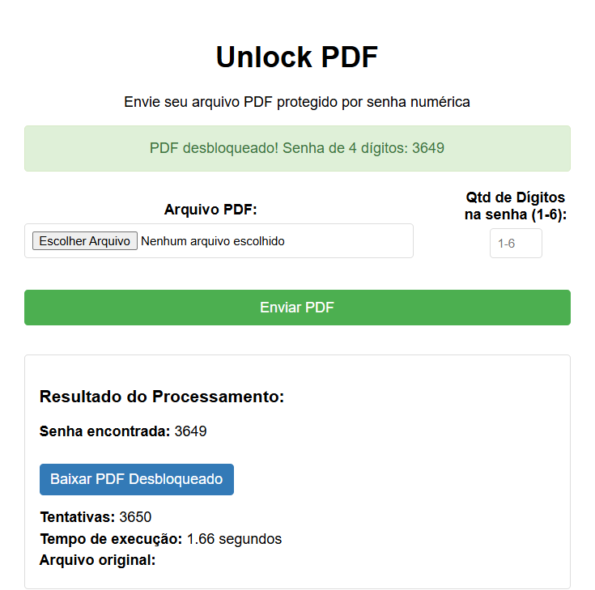

# 📄 Unlock PDF - Desbloqueador de PDFs Online  

Um projeto simples para desbloquear PDFs protegidos por senha numérica (até 6 dígitos), desenvolvido em **Django** com opção de versão estática para GitHub Pages.  

 *(adicione uma imagem do seu projeto)*  

## ✨ Funcionalidades  

- 🔓 Desbloqueia PDFs com senhas numéricas (1-6 dígitos)  
- ⚡ Processamento rápido para senhas curtas (até 4 dígitos)  
- 📁 Interface simples com upload de arquivo e seleção de dígitos  
- 🌐 Versão estática disponível para GitHub Pages  

## ⚙️ Tecnologias  

- **Backend**: Python 3 + Django + PyPDF2  
- **Frontend**: HTML5, CSS3, JavaScript  

## 🚀 Como Usar  

### Versão Django (Local)  
```bash
# Clone o repositório
git clone https://github.com/JBSilvaDev/unlock-pdf.git
cd unlock-pdf

# Crie um ambiente virtual (recomendado)
python -m venv venv
source venv/bin/activate  # Linux/Mac
venv\Scripts\activate     # Windows

# Instale as dependências
pip install -r requirements.txt

# Execute o servidor
python manage.py runserver
```
Acesse: `http://localhost:8000`  


## 📝 Licença  
Este projeto está sob licença MIT - veja o arquivo [LICENSE](LICENSE) para detalhes.  

--- 

**Desenvolvido por [JB Silva](https://github.com/JBSilvaDev)**

*(Personalize com seus dados reais!)*  

--- 

### 💡 Dica:  
Para melhorar o projeto, você poderia:  
- Adicionar uma barra de progresso durante o desbloqueio  
- Implementar filas de processamento com Celery  
- Criar um limite de tentativas por minuto  

👉 **Contribuições são bem-vindas!** Envie um PR ou abra uma issue.